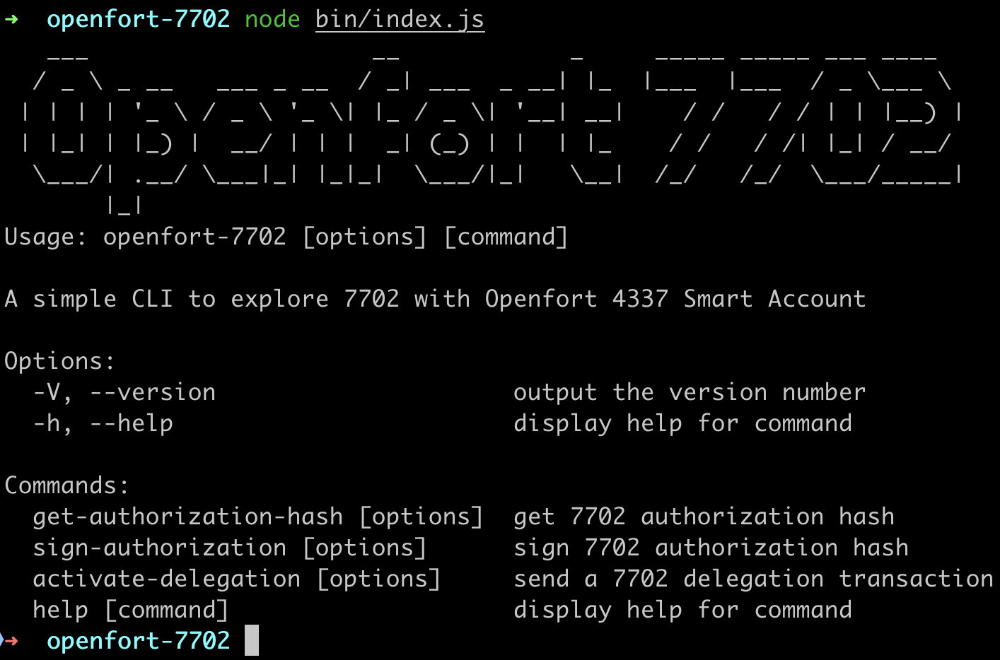

# Openfort 7702 CLI

Get authorization hash, sign it, send a 7702 transaction to delegate Openfort Smart Account to your EOA.
Enjoy 4337 features from the comfort of your EOA (batching, gas sponsoring with Paymaster, session keys).

## Requirements

Run anvil alphanet locally, an ethereum node with future hardfork (prague) containing EIP-7702.

`curl -L https://foundry.paradigm.xyz | bash && anvil --alphanet`

Run a local bundler with _entrypoint v6_

```
git clone https://github.com/pimlicolabs/alto
./alto --config scripts/config.local.json
```

# Deploy Openfort Smart Account (UpgradeableOpenfortProxy7702 is the delegation designator)

```
git clone git@github.com:openfort-xyz/openfort-contracts.git
forge install
forge build
forge create UpgradeableOpenfortAccount --private-key "0xac0974bec39a17e36ba4a6b4d238ff944bacb478cbed5efcae784d7bf4f2ff80"  --rpc-url "http://127.0.0.1:8545"
forge create UpgradeableOpenfortProxy7702 --constructor-args "0x5FbDB2315678afecb367f032d93F642f64180aa3" "0x" --private-key "0xac0974bec39a17e36ba4a6b4d238ff944bacb478cbed5efcae784d7bf4f2ff80"  --rpc-url "http://127.0.0.1:8545"
```

# Run the CLI

```
AUTHORITY_PRIVATE_KEY=0x59c6995e998f97a5a0044966f0945389dc9e86dae88c7a8412f4603b6b78690d
OPENFORT_SMART_ACCOUNT_PROXY=0xe7f1725E7734CE288F8367e1Bb143E90bb3F0512
OPENFORT_SMART_ACCOUNT_IMPLEMENTATION=0x5FbDB2315678afecb367f032d93F642f64180aa3
GUARDIAN_ADDRESS=0xf39Fd6e51aad88F6F4ce6aB8827279cffFb92266
yarn install
yarn build
node bin/index.js --help
```


