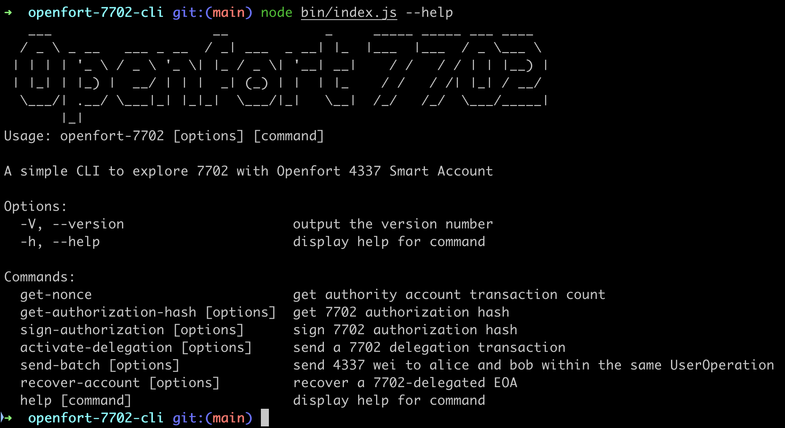

# Openfort 7702 - WIP

## Requirements

Run a local node with future hardfork (prague) containing EIP-7702

`curl -L https://foundry.paradigm.xyz | bash && anvil --alphanet`

# Deploy Openfort Smart Account (i.e the delegation designator)

```
git clone git@github.com:openfort-xyz/openfort-contracts.git
forge install
forge build
forge create UpgradeableOpenfortAccount --private-key "0x59c6995e998f97a5a0044966f0945389dc9e86dae88c7a8412f4603b6b78690d"  --rpc-url "http://127.0.0.1:8545"
```

# Run the CLI

```
yarn install
yarn build
node bin/index.js --help
```


